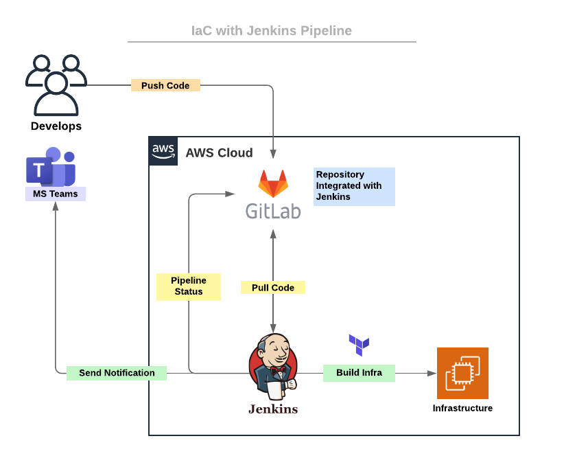

# Infrastrucute as Code with Jenkins Pipeline 

## Overview

- Simple CI/CD pipeline that triggers Jenkins job to build resources in AWS using Terraform. 
- The pipeline is set to be trigger by webhook. 
- The pipeline sends status to GitLab. 
- The pipeline send notification (if success) to MS365 Teams.

## Diagram:

## Terraform Resources:

- AWS Security Group
- AWS Security Group Rules
- AWS EC2 Instance
    - Packages updated
    - Hostname set
    - Apache installed 
- AWS Route53 A Records

## Prerequisites: 

- Localhost + GitLab ssh access
- Jenkins + GitLab integration 
- Jenkins + MS365 integration
- Jenkins Access to Terraform
- Terraform IAM Roles with permissions to provision resources in AWS
